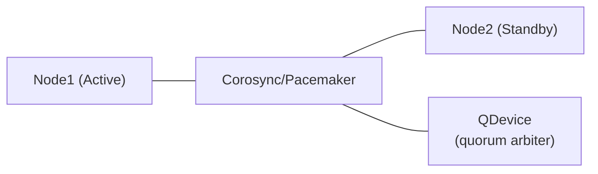

# PureMyHA

A simple, pure-Haskell High Availability tool for MySQL 8.4 replication topologies.

Inspired by the design philosophy of Orchestrator, PureMyHA provides topology discovery, failure detection, and automatic failover — with no C library dependencies.

## Features

- **Topology Discovery** — Recursively maps replication trees from seed hosts via `SHOW REPLICA STATUS`
- **Automatic Failover** — Detects dead sources and promotes the best replica (GTID-aware, errant-GTID-safe)
- **Manual Switchover** — Planned maintenance with zero-data-loss semantics
- **Errant GTID Detection & Repair** — Identifies and fixes errant GTIDs via empty transactions
- **Anti-Flap Protection** — Blocks repeated automatic failovers via configurable `recovery_block_period`
- **Hook Support** — Pre/post hooks for failover and switchover events
- **MySQL 8.4 Native** — Uses only modern syntax (`SHOW REPLICA STATUS`, `CHANGE REPLICATION SOURCE TO`, etc.)
- **Graceful Shutdown** — Cleans up the socket file and exits on SIGTERM/SIGINT
- **Config Hot-Reload** — Reloads monitoring and hooks config on SIGHUP without restart
- **Topology Auto-Discovery** — Automatically detects and begins monitoring new nodes at a configurable interval
- **Dry-run Mode** — Run `switchover --dry-run` to preview the candidate selection without executing any SQL

## Requirements

- **MySQL**: 8.4+ with GTID enabled (`gtid_mode=ON`, `enforce_gtid_consistency=ON`)
- **OS**: Linux
- **HA for PureMyHA itself**: Pacemaker + QDevice (recommended)

### MySQL Users

PureMyHA uses two distinct MySQL users.

#### Monitoring / management user

Connects to every node for health checks, topology discovery, and failover operations.

```sql
CREATE USER 'purermyha'@'%' IDENTIFIED BY '...';

-- Fine-grained privileges (MySQL 8.0+, recommended):
GRANT REPLICATION CLIENT      ON *.* TO 'purermyha'@'%';  -- SHOW REPLICA STATUS, SHOW REPLICAS
GRANT PROCESS                 ON *.* TO 'purermyha'@'%';  -- SHOW PROCESSLIST (topology discovery)
GRANT REPLICATION_SLAVE_ADMIN ON *.* TO 'purermyha'@'%';  -- STOP/START REPLICA, RESET REPLICA ALL, CHANGE REPLICATION SOURCE TO
GRANT SYSTEM_VARIABLES_ADMIN  ON *.* TO 'purermyha'@'%';  -- SET GLOBAL read_only
GRANT REPLICATION_APPLIER     ON *.* TO 'purermyha'@'%';  -- SET GTID_NEXT (errant GTID repair)

-- Or with the legacy SUPER privilege:
-- GRANT REPLICATION CLIENT, SUPER ON *.* TO 'purermyha'@'%';
```

#### Replication user

Used as `SOURCE_USER` in `CHANGE REPLICATION SOURCE TO` when reconnecting replicas after a failover or switchover. This is the same user already configured on each replica's `CHANGE REPLICATION SOURCE TO` statement.

```sql
CREATE USER 'repl'@'%' IDENTIFIED BY '...';
GRANT REPLICATION SLAVE ON *.* TO 'repl'@'%';
```

> **Note:** If you use the same account for both monitoring and replication, omit `replication_credentials` from the config. PureMyHA will fall back to `credentials` automatically.

## Architecture


| Component    | Role |
|-------------|------|
| `purermyhad` | Long-running daemon. Topology monitoring, failure detection, automatic failover |
| `purermyha`  | CLI tool. Status display and manual operations |

Daemon and CLI communicate over a Unix domain socket (`/run/purermyhad.sock`) using newline-delimited JSON.

### Daemon HA with Pacemaker



PureMyHA does **not** implement leader election itself — it delegates entirely to Pacemaker. Daemon state is held in memory only and rebuilt from MySQL on restart.

## Installation

### From packages (recommended)

Download the latest release from the [Releases page](https://github.com/ikaro1192/PureMyHA/releases).

#### Debian / Ubuntu

```bash
sudo dpkg -i purermyha_<VERSION>_amd64.deb    # x86_64
sudo dpkg -i purermyha_<VERSION>_arm64.deb    # aarch64
```

#### RHEL / Rocky / AlmaLinux

```bash
sudo rpm -ivh purermyha-<VERSION>-1.x86_64.rpm   # x86_64
sudo rpm -ivh purermyha-<VERSION>-1.aarch64.rpm  # aarch64
```

#### Post-install setup

```bash
# Copy the example config and edit it
sudo cp /etc/purermyha/config.yaml.example /etc/purermyha/config.yaml
sudo vi /etc/purermyha/config.yaml

# Enable and start the daemon
sudo systemctl enable --now purermyhad
```

### From source

- **Build requirements:** GHC 9.x+ and Cabal 3.0+ (not needed for package installs)

```bash
git clone https://github.com/ikaro1192/PureMyHA
cd PureMyHA
cabal build all
cabal install purermyhad purermyha
```

### Docker build (Linux binary)

Build Linux binaries without installing GHC locally.

```bash
# Build (tests run automatically during build)
docker build -t purermyha .

# Extract binaries
mkdir -p dist-bins
docker create --name tmp purermyha
docker cp tmp:/usr/bin/purermyha ./dist-bins/
docker cp tmp:/usr/sbin/purermyhad ./dist-bins/
docker rm tmp
```

## Configuration

Default path: `/etc/purermyha/config.yaml`

```yaml
clusters:
  - name: main
    nodes:
      - host: db1
        port: 3306
      - host: db2
        port: 3306
    credentials:
      user: purermyha
      password_file: /etc/purermyha/mysql.pass
    replication_credentials:           # Optional; falls back to credentials if omitted
      user: repl
      password_file: /etc/purermyha/repl.pass

monitoring:
  interval: 3s
  connect_timeout: 2s
  replication_lag_warning: 10s
  replication_lag_critical: 30s
  discovery_interval: 300s   # Optional; 0s = disabled. Default: 300s

failure_detection:
  recovery_block_period: 3600s   # Block auto-failover for this long after a failover

failover:
  auto_failover: true
  min_replicas_for_failover: 1
  candidate_priority:            # Optional promotion priority (auto-selected by GTID if omitted)
    - host: db2

hooks:
  pre_failover: /etc/purermyha/hooks/pre_failover.sh
  post_failover: /etc/purermyha/hooks/post_failover.sh
  pre_switchover: /etc/purermyha/hooks/pre_switchover.sh
  post_switchover: /etc/purermyha/hooks/post_switchover.sh
  on_failure_detection: /etc/purermyha/hooks/on_failure_detection.sh    # Optional
  post_unsuccessful_failover: /etc/purermyha/hooks/post_unsuccessful_failover.sh  # Optional

logging:
  log_file: /var/log/puremyha.log  # Optional; defaults to /var/log/puremyha.log
```

The `logging` section is optional. Omitting it entirely uses the default log file path.

See `config/config.yaml.example` for a full annotated example.

## Usage

### Start the daemon

```bash
purermyhad --config /etc/purermyha/config.yaml
```

### Daemon management

| Signal | Effect |
|--------|--------|
| `SIGTERM` / `SIGINT` | Graceful shutdown — stops all workers and removes the socket file |
| `SIGHUP` | Hot-reload `monitoring` and `hooks` config without restart |

```bash
# Reload config (e.g. after editing intervals or hooks)
systemctl reload purermyhad        # via systemd (preferred)
kill -HUP $(pidof purermyhad)      # direct signal (non-systemd)

# Graceful stop
kill -TERM $(pidof purermyhad)
```

### Global flags

| Flag | Short | Default | Description |
|------|-------|---------|-------------|
| `--socket PATH` | — | `/run/purermyhad.sock` | Daemon socket path |
| `--cluster NAME` | `-C` | — | Target cluster (omit to apply to all) |
| `--json` | `-j` | — | Output in JSON format instead of text |

### CLI commands

```bash
# Show topology and node health
purermyha status

# Show replication tree
purermyha topology

# Manual switchover (planned maintenance)
purermyha switchover [--to=<host>] [--cluster=<name>]

# Dry-run: show which replica would be promoted without executing
purermyha switchover --dry-run [--to=<host>]

# Acknowledge recovery block (re-enable auto-failover after anti-flap period)
purermyha ack-recovery [--cluster=<name>]

# Detect errant GTIDs
purermyha errant-gtid [--cluster=<name>]

# Fix errant GTIDs by injecting empty transactions
purermyha fix-errant-gtid [--cluster=<name>]

# Demote a node to replica under a specified source (resolve split-brain)
purermyha demote --host db1 --source db2 [--cluster=<name>]

# JSON output (for scripting / Prometheus exporters)
purermyha --json status
purermyha -j topology
purermyha -j errant-gtid
purermyha -j switchover --to db2

# Pipe to jq
purermyha -j status | jq '.[0].health'
purermyha -j topology | jq '.[0].nodes[].host'
```

## Logging

PureMyHA writes structured, timestamped logs via [katip](https://hackage.haskell.org/package/katip). The log file path is configured with `logging.log_file` (default: `/var/log/puremyha.log`).

### Logged events

| Event | Level |
|-------|-------|
| Daemon started | Info |
| Node unreachable / connect failed | Warn |
| Node recovered | Info |
| Auto-failover started / completed / failed | Info / Error |
| Switchover started / completed / failed | Info / Error |
| Config reloaded (SIGHUP) | Info |
| Config reload failed (SIGHUP) | Warn |
| Topology refresh: N new node(s) found | Info |
| Daemon shutting down | Info |

### Example output

```
[2026-03-17 12:34:56 UTC] [Info] purermyhad started
[2026-03-17 12:35:01 UTC] [Warn] [main] Node db1 unreachable: Connection refused
[2026-03-17 12:35:10 UTC] [Info] [main] Auto-failover started
[2026-03-17 12:35:12 UTC] [Info] [main] Auto-failover completed: new source is db2
[2026-03-17 12:35:13 UTC] [Info] [main] Node db1 recovered
```

## Failover Flow

When `DeadSource` is detected, the daemon automatically:

1. Runs `pre_failover` hook
2. Selects the best replica (highest `Executed_Gtid_Set`, no errant GTIDs, respects `candidate_priority`)
3. Promotes: `STOP REPLICA` → `RESET REPLICA ALL` → `SET read_only=OFF`
4. Reconnects remaining replicas: `CHANGE REPLICATION SOURCE TO SOURCE_HOST=... SOURCE_USER=... SOURCE_PASSWORD=... SOURCE_AUTO_POSITION=1`
5. Runs `post_failover` hook
6. Sets `recovery_block_period` anti-flap timer

## Failure Scenarios

| Scenario | Definition |
|---------|------------|
| `Healthy` | Normal operation |
| `DeadSource` | Source unreachable and replicas confirm `Replica_IO_Running=No` |
| `UnreachableSource` | Source unreachable from PureMyHA, but replicas can still reach it (possible network partition) |
| `DeadSourceAndAllReplicas` | Source and all replicas are unresponsive |
| `SplitBrainSuspected` | Multiple nodes appear to be acting as source |
| `NeedsAttention` | Other anomaly (errant GTIDs, stale replication, etc.) |

## Technology Stack

| Purpose | Library |
|---------|---------|
| MySQL connectivity | `mysql-haskell` (pure Haskell, no C library dependency) |
| Configuration | `yaml` + `optparse-applicative` |
| Concurrency | `async` + `STM` (each node monitored in an independent thread) |
| Logging | `katip` (structured logging with JSON output) |
| IPC | Unix domain socket, newline-delimited JSON |

## Development

```bash
# Build
cabal build all

# Run tests
cabal test

# Run with a local config
cabal run purermyhad -- --config config/config.yaml.example
```

## License

MIT
