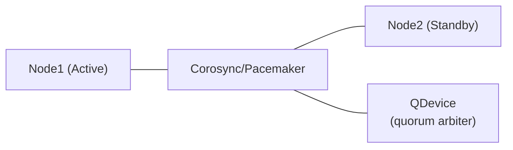

# PureMyHA

A simple, pure-Haskell High Availability tool for MySQL 8.4 replication topologies.

Inspired by the design philosophy of Orchestrator, PureMyHA provides topology discovery, failure detection, and automatic failover — with no C library dependencies.

## Features

- **Topology Discovery** — Recursively maps replication trees from seed hosts via `SHOW REPLICA STATUS`
- **Automatic Failover** — Detects dead sources and promotes the best replica (GTID-aware, errant-GTID-safe, waits for relay log apply)
- **Manual Switchover** — Planned maintenance with zero-data-loss semantics
- **Errant GTID Detection & Repair** — Identifies and fixes errant GTIDs via empty transactions
- **Anti-Flap Protection** — Blocks repeated automatic failovers via configurable `recovery_block_period`
- **Hook Support** — Pre/post hooks for failover and switchover events
- **MySQL 8.4 Native** — Uses only modern syntax (`SHOW REPLICA STATUS`, `CHANGE REPLICATION SOURCE TO`, etc.)
- **Graceful Shutdown** — Cleans up the socket file and exits on SIGTERM/SIGINT
- **Config Hot-Reload** — Reloads `monitoring` and `hooks` config per cluster on SIGHUP without restart
- **Topology Auto-Discovery** — Automatically detects and begins monitoring new nodes at a configurable interval
- **Dry-run Mode** — Run `switchover --dry-run` to preview the candidate selection without executing any SQL
- **Pause/Resume Auto-Failover** — Temporarily disable automatic failover for maintenance windows

## Requirements

- **MySQL**: 8.4+ with GTID enabled (`gtid_mode=ON`, `enforce_gtid_consistency=ON`) and `caching_sha2_password` authentication (default in MySQL 8.4). `mysql_native_password` is not supported.
- **OS**: Linux
- **HA for PureMyHA itself**: Pacemaker + QDevice (recommended)

### MySQL Users

PureMyHA uses two distinct MySQL users.

#### Monitoring / management user

Connects to every node for health checks, topology discovery, and failover operations.

```sql
CREATE USER 'puremyha'@'%' IDENTIFIED BY '...';

-- Fine-grained privileges (MySQL 8.0+, recommended):
GRANT REPLICATION CLIENT      ON *.* TO 'puremyha'@'%';  -- SHOW REPLICA STATUS, SHOW REPLICAS
GRANT PROCESS                 ON *.* TO 'puremyha'@'%';  -- SHOW PROCESSLIST (topology discovery)
GRANT REPLICATION_SLAVE_ADMIN ON *.* TO 'puremyha'@'%';  -- STOP/START REPLICA, RESET REPLICA ALL, CHANGE REPLICATION SOURCE TO
GRANT SYSTEM_VARIABLES_ADMIN  ON *.* TO 'puremyha'@'%';  -- SET GLOBAL read_only
GRANT REPLICATION_APPLIER     ON *.* TO 'puremyha'@'%';  -- SET GTID_NEXT (errant GTID repair)

-- Or with the legacy SUPER privilege:
-- GRANT REPLICATION CLIENT, SUPER ON *.* TO 'puremyha'@'%';
```

#### Replication user

Used as `SOURCE_USER` in `CHANGE REPLICATION SOURCE TO` when reconnecting replicas after a failover or switchover. This is the same user already configured on each replica's `CHANGE REPLICATION SOURCE TO` statement.

```sql
CREATE USER 'repl'@'%' IDENTIFIED BY '...';
GRANT REPLICATION SLAVE ON *.* TO 'repl'@'%';
```

> **Note:** If you use the same account for both monitoring and replication, omit `replication_credentials` from the config. PureMyHA will fall back to `credentials` automatically.

## Architecture


| Component    | Role |
|-------------|------|
| `puremyhad` | Long-running daemon. Topology monitoring, failure detection, automatic failover |
| `puremyha`  | CLI tool. Status display and manual operations |

Daemon and CLI communicate over a Unix domain socket (`/run/puremyhad.sock`) using newline-delimited JSON.

### Daemon HA with Pacemaker



PureMyHA does **not** implement leader election itself — it delegates entirely to Pacemaker. Daemon state is held in memory only and rebuilt from MySQL on restart.

Sample configuration files and a Docker Compose demo are in [`pacemaker/`](pacemaker/).

#### Quick start (Docker Compose demo)

```bash
cd pacemaker/demo

# 1. Build the puremyhad binary and cluster images
make build

# 2. Start containers (ha1, ha2, qdevice)
make start

# 3. Initialize the cluster
make setup

# 4. Check cluster status
make status

# 5. Test failover (puremyhad moves from ha1 to ha2)
make failover

# 6. Clean up
make clean
```

> **Note:** STONITH is disabled in the demo. See the production setup below.

#### Production setup

**Target topology**

| Host | Role | Required packages |
|------|------|-------------------|
| ha1 (192.168.10.11) | Cluster node (Active) | pacemaker, pcs, corosync, fence-agents |
| ha2 (192.168.10.12) | Cluster node (Standby) | pacemaker, pcs, corosync, fence-agents |
| qdevice (192.168.10.13) | Quorum arbiter only | corosync-qnetd |

A Virtual IP (e.g. `192.168.10.100`) floats to whichever node runs `puremyhad`.

**Step 1 — Install packages**

```bash
# On ha1 and ha2:
apt-get install -y pacemaker pcs corosync fence-agents   # Debian/Ubuntu
# dnf install -y pacemaker pcs corosync fence-agents-all  # RHEL/Rocky

# On the QDevice host only:
apt-get install -y corosync-qnetd
systemctl enable --now corosync-qnetd
```

**Step 2 — Configure Corosync**

Copy [`pacemaker/corosync.conf.example`](pacemaker/corosync.conf.example) to `/etc/corosync/corosync.conf` on **both** ha1 and ha2. Replace the example IPs with your actual addresses.

**Step 3 — Disable systemd auto-restart for puremyhad**

`puremyhad.service` has `Restart=on-failure`. When Pacemaker manages the daemon, systemd must **not** restart it independently — they would race.

Run on **both** ha1 and ha2:

```bash
mkdir -p /etc/systemd/system/puremyhad.service.d/
cat > /etc/systemd/system/puremyhad.service.d/pacemaker.conf << 'EOF'
[Service]
Restart=no
EOF
systemctl daemon-reload
systemctl disable puremyhad   # Pacemaker starts it, not systemd
```

**Step 4 — Install the OCF Resource Agent**

```bash
# On ha1 and ha2:
install -m 755 pacemaker/ocf/puremyha \
    /usr/lib/ocf/resource.d/puremyha/puremyhad
```

**Step 5 — Bootstrap the cluster**

```bash
# Set the hacluster password (same on both nodes):
echo "PASSWORD" | passwd --stdin hacluster

# Run on ha1 only:
pcs host auth ha1 ha2 -u hacluster -p PASSWORD
pcs cluster setup puremyha-cluster ha1 ha2 --start --enable
```

**Step 6 — Add the QDevice**

```bash
pcs quorum device add model net host=192.168.10.13 algorithm=ffsplit
pcs quorum status   # confirm expected_votes: 3
```

**Step 7 — Configure STONITH**

STONITH is **mandatory** in production. Without fencing, a split-brain can leave two nodes running `puremyhad` simultaneously.

```bash
# IPMI/BMC fencing (bare metal):
pcs stonith create fence-ha1 fence_ipmilan \
    ipaddr=192.168.10.101 login=admin passwd=PASSWORD lanplus=1 \
    pcmk_host_list=ha1
pcs stonith create fence-ha2 fence_ipmilan \
    ipaddr=192.168.10.102 login=admin passwd=PASSWORD lanplus=1 \
    pcmk_host_list=ha2

# Each node is fenced by the other:
pcs constraint location fence-ha1 avoids ha1
pcs constraint location fence-ha2 avoids ha2
```

**Step 8 — Create resources**

```bash
# Virtual IP
pcs resource create puremyha-vip IPaddr2 \
    ip=192.168.10.100 cidr_netmask=24 \
    op monitor interval=10s

# puremyhad daemon (OCF RA)
pcs resource create puremyhad ocf:puremyha:puremyhad \
    config=/etc/puremyha/config.yaml \
    socket=/run/puremyhad.sock \
    op start timeout=30s op stop timeout=30s \
    op monitor interval=15s timeout=15s

# VIP always colocated with puremyhad; puremyhad starts first
pcs constraint colocation add puremyha-vip with puremyhad INFINITY
pcs constraint order puremyhad then puremyha-vip
```

See [`pacemaker/setup.sh`](pacemaker/setup.sh) for a fully annotated reference script.

#### Verification

```bash
# Overall cluster health
pcs status

# Confirm QDevice vote is active (expected_votes: 3)
pcs quorum status

# Planned failover test
pcs node standby ha1          # puremyhad migrates to ha2
pcs status
pcs node unstandby ha1        # ha1 rejoins as standby

# Confirm socket exists only on the active node
ls -la /run/puremyhad.sock    # run on the active node — should exist

# Config reload (sends SIGHUP via ExecReload in the systemd unit)
pcs resource reload puremyhad
```

## Installation

### From packages (recommended)

Download the latest release from the [Releases page](https://github.com/ikaro1192/PureMyHA/releases).

#### Debian / Ubuntu

```bash
sudo dpkg -i puremyha_<VERSION>_amd64.deb    # x86_64
sudo dpkg -i puremyha_<VERSION>_arm64.deb    # aarch64
```

#### RHEL / Rocky / AlmaLinux

```bash
sudo rpm -ivh puremyha-<VERSION>-1.x86_64.rpm   # x86_64
sudo rpm -ivh puremyha-<VERSION>-1.aarch64.rpm  # aarch64
```

#### Post-install setup

```bash
# Copy the example config and edit it
sudo cp /etc/puremyha/config.yaml.example /etc/puremyha/config.yaml
sudo vi /etc/puremyha/config.yaml

# Enable and start the daemon
sudo systemctl enable --now puremyhad
```

### From source

- **Build requirements:** GHC 9.x+ and Cabal 3.0+ (not needed for package installs)

```bash
git clone https://github.com/ikaro1192/PureMyHA
cd PureMyHA
cabal build all
cabal install puremyhad puremyha
```

### Docker build (Linux binary)

Build Linux binaries without installing GHC locally.

```bash
# Build (tests run automatically during build)
docker build -t puremyha .

# Extract binaries
mkdir -p dist-bins
docker create --name tmp puremyha
docker cp tmp:/usr/bin/puremyha ./dist-bins/
docker cp tmp:/usr/sbin/puremyhad ./dist-bins/
docker rm tmp
```

## Configuration

Default path: `/etc/puremyha/config.yaml`

```yaml
clusters:
  - name: main
    nodes:
      - host: db1
        port: 3306
      - host: db2
        port: 3306
    credentials:
      user: puremyha
      password_file: /etc/puremyha/mysql.pass
    replication_credentials:           # Optional; falls back to credentials if omitted
      user: repl
      password_file: /etc/puremyha/repl.pass
    # monitoring / failure_detection / failover / hooks can be specified here
    # to override the global defaults for this cluster only.

global:
  monitoring:
    interval: 3s
    connect_timeout: 2s
    replication_lag_warning: 10s
    replication_lag_critical: 30s
    discovery_interval: 300s   # Optional; 0s = disabled. Default: 300s
  failure_detection:
    recovery_block_period: 3600s   # Block auto-failover for this long after a failover
  failover:
    auto_failover: true
    min_replicas_for_failover: 1
    wait_for_relay_log_apply_timeout: 60s  # Optional; default: 60s
    candidate_priority:            # Optional promotion priority (auto-selected by GTID if omitted)
      - host: db2
  hooks:
    pre_failover: /etc/puremyha/hooks/pre_failover.sh
    post_failover: /etc/puremyha/hooks/post_failover.sh
    pre_switchover: /etc/puremyha/hooks/pre_switchover.sh
    post_switchover: /etc/puremyha/hooks/post_switchover.sh
    on_failure_detection: /etc/puremyha/hooks/on_failure_detection.sh    # Optional
    post_unsuccessful_failover: /etc/puremyha/hooks/post_unsuccessful_failover.sh  # Optional

logging:
  log_file: /var/log/puremyha.log  # Optional; defaults to /var/log/puremyha.log
```

`monitoring`, `failure_detection`, `failover`, and `hooks` can be set per-cluster or defined as defaults in the `global` section. Per-cluster settings take precedence over `global` on a section-by-section basis. `monitoring`, `failure_detection`, and `failover` are required in at least one of the two. The `logging` section is optional and global (defaults to `/var/log/puremyha.log` when omitted).

See `config/config.yaml.example` for a full annotated example.

## Usage

### Start the daemon

```bash
puremyhad --config /etc/puremyha/config.yaml
```

### Daemon management

| Signal | Effect |
|--------|--------|
| `SIGTERM` / `SIGINT` | Graceful shutdown — stops all workers and removes the socket file |
| `SIGHUP` | Hot-reload `monitoring` and `hooks` config per cluster without restart |

```bash
# Reload config (e.g. after editing intervals or hooks)
systemctl reload puremyhad        # via systemd (preferred)
kill -HUP $(pidof puremyhad)      # direct signal (non-systemd)

# Graceful stop
kill -TERM $(pidof puremyhad)
```

### Global flags

| Flag | Short | Default | Description |
|------|-------|---------|-------------|
| `--socket PATH` | — | `/run/puremyhad.sock` | Daemon socket path |
| `--cluster NAME` | `-C` | — | Target cluster (omit to apply to all) |
| `--json` | `-j` | — | Output in JSON format instead of text |

### CLI commands

```bash
# Show topology and node health
puremyha status

# Show replication tree
puremyha topology

# Manual switchover (planned maintenance)
puremyha switchover [--to=<host>] [--cluster=<name>]

# Dry-run: show which replica would be promoted without executing
puremyha switchover --dry-run [--to=<host>]

# Acknowledge recovery block (re-enable auto-failover after anti-flap period)
puremyha ack-recovery [--cluster=<name>]

# Detect errant GTIDs
puremyha errant-gtid [--cluster=<name>]

# Fix errant GTIDs by injecting empty transactions
puremyha fix-errant-gtid [--cluster=<name>]

# Demote a node to replica under a specified source (resolve split-brain)
puremyha demote --host db1 --source db2 [--cluster=<name>]

# Pause replication on a replica (STOP REPLICA + stop monitoring)
puremyha pause-replica --host db2 [--cluster=<name>]

# Resume replication on a paused replica (START REPLICA + resume monitoring)
puremyha resume-replica --host db2 [--cluster=<name>]

# Trigger manual topology discovery
puremyha discovery [--cluster=<name>]

# Pause automatic failover (e.g. during maintenance)
puremyha pause-failover [--cluster=<name>]

# Resume automatic failover
puremyha resume-failover [--cluster=<name>]

# JSON output (for scripting / Prometheus exporters)
puremyha --json status
puremyha -j topology
puremyha -j errant-gtid
puremyha -j switchover --to db2

# Pipe to jq
puremyha -j status | jq '.[0].health'
puremyha -j topology | jq '.[0].nodes[].host'
```

## Logging

PureMyHA writes structured, timestamped logs via [katip](https://hackage.haskell.org/package/katip). The log file path is configured with `logging.log_file` (default: `/var/log/puremyha.log`).

### Logged events

| Event | Level |
|-------|-------|
| Daemon started | Info |
| Node unreachable / connect failed | Warn |
| Node recovered | Info |
| Auto-failover started / completed / failed | Info / Error |
| Switchover started / completed / failed | Info / Error |
| Config reloaded (SIGHUP) | Info |
| Config reload failed (SIGHUP) | Warn |
| Topology refresh: N new node(s) found | Info |
| Daemon shutting down | Info |

### Example output

```
[2026-03-17 12:34:56 UTC] [Info] puremyhad started
[2026-03-17 12:35:01 UTC] [Warn] [main] Node db1 unreachable: Connection refused
[2026-03-17 12:35:10 UTC] [Info] [main] Auto-failover started
[2026-03-17 12:35:12 UTC] [Info] [main] Auto-failover completed: new source is db2
[2026-03-17 12:35:13 UTC] [Info] [main] Node db1 recovered
```

## Failover Flow

When `DeadSource` is detected, the daemon automatically:

1. Runs `pre_failover` hook
2. Selects the best replica (highest `Executed_Gtid_Set`, no errant GTIDs, respects `candidate_priority`)
3. Waits for the candidate to apply all retrieved GTIDs (`wait_for_relay_log_apply_timeout`, default 60 s)
4. Promotes: `STOP REPLICA` → `RESET REPLICA ALL` → `SET read_only=OFF`
5. Reconnects remaining replicas: `CHANGE REPLICATION SOURCE TO SOURCE_HOST=... SOURCE_USER=... SOURCE_PASSWORD=... SOURCE_AUTO_POSITION=1`
6. Runs `post_failover` hook
7. Sets `recovery_block_period` anti-flap timer

## Failure Scenarios

| Scenario | Definition |
|---------|------------|
| `Healthy` | Normal operation |
| `DeadSource` | Source unreachable and replicas confirm `Replica_IO_Running=No` |
| `UnreachableSource` | Source unreachable from PureMyHA, but replicas can still reach it (possible network partition) |
| `DeadSourceAndAllReplicas` | Source and all replicas are unresponsive |
| `SplitBrainSuspected` | Multiple nodes appear to be acting as source |
| `NeedsAttention` | Other anomaly (errant GTIDs, stale replication, etc.) |

## Technology Stack

| Purpose | Library |
|---------|---------|
| MySQL connectivity | `mysql-haskell` (pure Haskell, no C library dependency) + custom `caching_sha2_password` auth |
| Configuration | `yaml` + `optparse-applicative` |
| Concurrency | `async` + `STM` (each node monitored in an independent thread) |
| Logging | `katip` (structured logging with JSON output) |
| IPC | Unix domain socket, newline-delimited JSON |

## Development

```bash
# Build
cabal build all

# Run tests
cabal test

# Run with a local config
cabal run puremyhad -- --config config/config.yaml.example
```

### E2E Tests

The `e2e/` directory contains a Docker Compose based end-to-end test framework. It spins up a real MySQL 8.4 GTID-replication cluster (1 source + 2 replicas) and runs failover scenarios against the `puremyhad` daemon.

**Prerequisites:** Docker and Docker Compose.

```bash
cd e2e

# Run all tests
make e2e

# Run a specific test (e.g., auto-failover only)
make e2e-test T=02

# Follow puremyhad logs (useful for debugging)
make e2e-logs

# Check container status
make e2e-status

# Tear down the environment
make e2e-clean
```

#### Test scenarios

There are test scripts in `e2e/tests/`. Filenames are self-documenting (e.g. `01-topology-discovery.sh`, `10-pause-resume-failover.sh`).

The test environment uses accelerated timings (`interval: 1s`, `recovery_block_period: 30s`) so the full suite completes in a few minutes. Cluster state is automatically reset between tests.

## License

MIT
