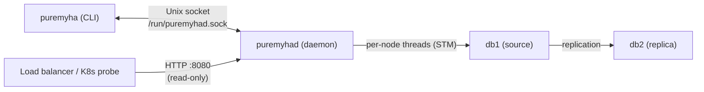

# PureMyHA

[](https://github.com/ikaro1192/PureMyHA/actions/workflows/ci.yml)
[](https://github.com/ikaro1192/PureMyHA/releases/latest)
[](LICENSE)
[](https://www.haskell.org/)

A simple, pure-Haskell High Availability tool for MySQL 8.4 replication topologies.

Inspired by the design philosophy of Orchestrator, PureMyHA provides topology discovery, failure detection, and automatic failover — with no C library dependencies.

## Philosophy

- **Pure Haskell, no C dependencies** — PureMyHA is built entirely on `mysql-haskell`, a pure-Haskell MySQL client. No libmysqlclient, no CGo, no FFI — just a single statically-linked binary that runs anywhere.
- **Correctness before convenience** — Every failover decision is GTID-aware: errant GTIDs are detected and repaired, relay log apply is awaited before promotion, and split-brain scenarios are identified before acting. A failover that corrupts data is worse than no failover.
- **Simple by deliberate omission** — PureMyHA targets MySQL 8.4+ exclusively and does not support legacy syntax, older authentication plugins, or non-GTID topologies. Saying no to compatibility layers keeps the code small, auditable, and correct.
- **Do one thing well** — PureMyHA is a focused HA tool, not a topology manager, query router, or schema migration framework. It detects failure, promotes a replica, and gets out of the way.
- **Delegate what you do not own** — PureMyHA does not implement leader election for itself. Its own high availability is delegated entirely to Pacemaker, which is already purpose-built for that problem.
- **Stateless by design** — The daemon holds no durable state. All topology knowledge is derived from MySQL on startup and continuously refreshed at runtime, making recovery from a daemon crash trivially safe.
- **Transparent operation** — Dry-run mode, config hot-reload, and pause/resume controls give operators full visibility and control without requiring a daemon restart.

## Features

- **Topology Discovery** — Recursively maps replication trees from seed hosts via `SHOW REPLICA STATUS`
- **Automatic Failover** — Detects dead sources and promotes the best replica (GTID-aware, errant-GTID-safe, waits for relay log apply)
- **Manual Switchover** — Planned maintenance with zero-data-loss semantics
- **Errant GTID Detection & Repair** — Identifies and fixes errant GTIDs via empty transactions
- **Consecutive Failure Threshold** — Requires N consecutive probe failures before marking a node dead, preventing failover on transient TCP timeouts or momentary MySQL unresponsiveness (configurable `consecutive_failures_for_dead`, default 3)
- **Anti-Flap Protection** — Blocks repeated automatic failovers via configurable `recovery_block_period`
- **Hook Support** — Pre/post hooks for failover and switchover events
- **MySQL 8.4 Native** — Uses only modern syntax (`SHOW REPLICA STATUS`, `CHANGE REPLICATION SOURCE TO`, etc.)
- **Graceful Shutdown** — Cleans up the socket file and exits on SIGTERM/SIGINT
- **Config Hot-Reload** — Reloads `monitoring` and `hooks` config per cluster on SIGHUP without restart
- **Topology Auto-Discovery** — Automatically detects and begins monitoring new nodes at a configurable interval
- **Dry-run Mode** — Run `switchover --dry-run` to preview the candidate selection without executing any SQL
- **Pause/Resume Auto-Failover** — Temporarily disable automatic failover for maintenance windows
- **HTTP Health Check Endpoint** — Optional read-only HTTP listener for load balancer probes and Kubernetes liveness/readiness checks (`GET /health`, `/cluster/:name/status`, `/cluster/:name/topology`)
- **Prometheus Metrics Endpoint** — `GET /metrics` exposes cluster health, replication lag, consecutive failures, and node role in Prometheus text exposition format for Grafana and other monitoring stacks
- **Runtime Log Level Control** — Change log verbosity without restarting the daemon via `puremyha set-log-level debug|info|warn|error` (IPC override takes precedence until the next SIGHUP, which resets to the configured `log_level`)
- **Config Validation** — `puremyha validate-config` validates the config file offline (no daemon required), reporting YAML parse errors, missing required fields, and semantic constraint violations (port ranges, threshold ordering, etc.)

## Requirements

- **MySQL**: 8.4+ with GTID enabled (`gtid_mode=ON`, `enforce_gtid_consistency=ON`) and `caching_sha2_password` authentication (default in MySQL 8.4). `mysql_native_password` is not supported.
- **OS**: Linux
- **HA for PureMyHA itself** *(optional)*: Pacemaker + QDevice (recommended) or VIP-watching cron / systemd.timer (simple)

### MySQL Users

PureMyHA uses two distinct MySQL users.

#### Monitoring / management user

Connects to every node for health checks, topology discovery, and failover operations.

```sql
CREATE USER 'puremyha'@'%' IDENTIFIED BY '...';

-- Fine-grained privileges (MySQL 8.0+, recommended):
GRANT REPLICATION CLIENT      ON *.* TO 'puremyha'@'%';  -- SHOW REPLICA STATUS, SHOW REPLICAS
GRANT PROCESS                 ON *.* TO 'puremyha'@'%';  -- SHOW PROCESSLIST (topology discovery)
GRANT REPLICATION_SLAVE_ADMIN ON *.* TO 'puremyha'@'%';  -- STOP/START REPLICA, RESET REPLICA ALL, CHANGE REPLICATION SOURCE TO
GRANT SYSTEM_VARIABLES_ADMIN  ON *.* TO 'puremyha'@'%';  -- SET GLOBAL read_only
GRANT REPLICATION_APPLIER     ON *.* TO 'puremyha'@'%';  -- SET GTID_NEXT (errant GTID repair)

-- Or with the legacy SUPER privilege:
-- GRANT REPLICATION CLIENT, SUPER ON *.* TO 'puremyha'@'%';
```

#### Replication user

Used as `SOURCE_USER` in `CHANGE REPLICATION SOURCE TO` when reconnecting replicas after a failover or switchover. This is the same user already configured on each replica's `CHANGE REPLICATION SOURCE TO` statement.

```sql
CREATE USER 'repl'@'%' IDENTIFIED BY '...';
GRANT REPLICATION SLAVE ON *.* TO 'repl'@'%';
```

> **Note:** If you use the same account for both monitoring and replication, omit `replication_credentials` from the config. PureMyHA will fall back to `credentials` automatically.

## Architecture



| Component    | Role |
|-------------|------|
| `puremyhad` | Long-running daemon. Topology monitoring, failure detection, automatic failover |
| `puremyha`  | CLI tool. Status display and manual operations |

Daemon and CLI communicate over a Unix domain socket (`/run/puremyhad.sock`) using newline-delimited JSON.
An optional HTTP listener (disabled by default) exposes read-only health check endpoints for external probes.

### Daemon HA

PureMyHA does **not** implement leader election itself. Two approaches are available:

- **Pacemaker (recommended)** — full cluster management with STONITH fencing
- **VIP-watching cron / systemd.timer (simple)** — lightweight alternative when a VIP is already managed by keepalived

See [docs/daemon-ha.md](docs/daemon-ha.md) for setup instructions for both approaches.

## Installation

### From packages (recommended)

Download the latest release from the [Releases page](https://github.com/ikaro1192/PureMyHA/releases).

#### Debian / Ubuntu

```bash
sudo dpkg -i puremyha_<VERSION>_amd64.deb    # x86_64
sudo dpkg -i puremyha_<VERSION>_arm64.deb    # aarch64
```

#### RHEL / Rocky / AlmaLinux

```bash
sudo rpm -ivh puremyha-<VERSION>-1.x86_64.rpm   # x86_64
sudo rpm -ivh puremyha-<VERSION>-1.aarch64.rpm  # aarch64
```

#### Post-install setup

```bash
# Copy the example config and edit it
sudo cp /etc/puremyha/config.yaml.example /etc/puremyha/config.yaml
sudo vi /etc/puremyha/config.yaml

# Enable and start the daemon
sudo systemctl enable --now puremyhad
```

### From source

- **Build requirements:** GHC 9.x+ and Cabal 3.0+ (not needed for package installs)

```bash
git clone https://github.com/ikaro1192/PureMyHA
cd PureMyHA
cabal build all
cabal install puremyhad puremyha
```

### Docker build (Linux binary)

Build Linux binaries without installing GHC locally.

```bash
# Build (tests run automatically during build)
docker build -t puremyha .

# Extract binaries
mkdir -p dist-bins
docker create --name tmp puremyha
docker cp tmp:/usr/bin/puremyha ./dist-bins/
docker cp tmp:/usr/sbin/puremyhad ./dist-bins/
docker rm tmp
```

## Configuration

Default path: `/etc/puremyha/config.yaml`

```yaml
clusters:
  - name: main
    nodes:
      - host: db1
        port: 3306
      - host: db2
        port: 3306
    credentials:
      user: puremyha
      password_file: /etc/puremyha/mysql.pass
    replication_credentials:           # Optional; falls back to credentials if omitted
      user: repl
      password_file: /etc/puremyha/repl.pass
    # monitoring / failure_detection / failover / hooks can be specified here
    # to override the global defaults for this cluster only.

global:
  monitoring:
    interval: 3s
    connect_timeout: 2s
    replication_lag_warning: 10s
    replication_lag_critical: 30s
    discovery_interval: 300s   # Optional; 0s = disabled. Default: 300s
  failure_detection:
    recovery_block_period: 3600s   # Block auto-failover for this long after a failover
    consecutive_failures_for_dead: 3  # Require N consecutive probe failures before marking a node dead (default: 3)
  failover:
    auto_failover: true
    min_replicas_for_failover: 1
    wait_for_relay_log_apply_timeout: 60s  # Optional; default: 60s
    candidate_priority:            # Optional promotion priority (auto-selected by GTID if omitted)
      - host: db2
  hooks:
    pre_failover: /etc/puremyha/hooks/pre_failover.sh
    post_failover: /etc/puremyha/hooks/post_failover.sh
    pre_switchover: /etc/puremyha/hooks/pre_switchover.sh
    post_switchover: /etc/puremyha/hooks/post_switchover.sh
    on_failure_detection: /etc/puremyha/hooks/on_failure_detection.sh    # Optional
    post_unsuccessful_failover: /etc/puremyha/hooks/post_unsuccessful_failover.sh  # Optional

http:                                  # Optional HTTP server (disabled by default)
  enabled: false
  listen_address: "127.0.0.1"        # Use "0.0.0.0" to listen on all interfaces
  port: 8080
  # Endpoints (read-only, GET only):
  #   GET /health                 → 200 {"status":"ok"} / 503 {"status":"degraded"}
  #   GET /cluster/:name/status   → ClusterStatus JSON
  #   GET /cluster/:name/topology → ClusterTopologyView JSON
  #   GET /metrics                → Prometheus text format metrics (all clusters)

logging:
  log_file: /var/log/puremyha.log  # Optional; defaults to /var/log/puremyha.log
  log_level: info                   # Optional; debug | info | warn | error (default: info)
```

`monitoring`, `failure_detection`, `failover`, and `hooks` can be set per-cluster or defined as defaults in the `global` section. Per-cluster settings take precedence over `global` on a section-by-section basis. `monitoring`, `failure_detection`, and `failover` are required in at least one of the two. The `logging` section is optional and global (defaults to `/var/log/puremyha.log` and `log_level: info` when omitted).

See `config/config.yaml.example` for a full annotated example.

## Usage

### Start the daemon

```bash
puremyhad --config /etc/puremyha/config.yaml
```

### Daemon management

| Signal | Effect |
|--------|--------|
| `SIGTERM` / `SIGINT` | Graceful shutdown — stops all workers and removes the socket file |
| `SIGHUP` | Hot-reload `monitoring`, `hooks`, `http`, and `log_level` config without restart |
| `SIGUSR1` | Reopen the log file (for log rotation tools such as logrotate) |

```bash
# Reload config (e.g. after editing intervals, hooks, or log_level)
systemctl reload puremyhad        # via systemd (preferred)
kill -HUP $(pidof puremyhad)      # direct signal (non-systemd)

# Graceful stop
kill -TERM $(pidof puremyhad)
```

### Global flags

| Flag | Short | Default | Description |
|------|-------|---------|-------------|
| `--socket PATH` | — | `/run/puremyhad.sock` | Daemon socket path |
| `--cluster NAME` | `-C` | — | Target cluster (omit to apply to all) |
| `--json` | `-j` | — | Output in JSON format instead of text |

### CLI commands

```bash
# Show topology and node health
puremyha status

# Show replication tree
puremyha topology

# Manual switchover (planned maintenance)
puremyha switchover [--to=<host>] [--cluster=<name>]

# Dry-run: show which replica would be promoted without executing
puremyha switchover --dry-run [--to=<host>]

# Acknowledge recovery block (re-enable auto-failover after anti-flap period)
puremyha ack-recovery [--cluster=<name>]

# Detect errant GTIDs
puremyha errant-gtid [--cluster=<name>]

# Fix errant GTIDs by injecting empty transactions
puremyha fix-errant-gtid [--cluster=<name>]

# Demote a node to replica under a specified source (resolve split-brain)
puremyha demote --host db1 --source db2 [--cluster=<name>]

# Pause replication on a replica (STOP REPLICA + stop monitoring)
puremyha pause-replica --host db2 [--cluster=<name>]

# Resume replication on a paused replica (START REPLICA + resume monitoring)
puremyha resume-replica --host db2 [--cluster=<name>]

# Trigger manual topology discovery
puremyha discovery [--cluster=<name>]

# Pause automatic failover (e.g. during maintenance)
puremyha pause-failover [--cluster=<name>]

# Resume automatic failover
puremyha resume-failover [--cluster=<name>]

# Change daemon log level at runtime (no restart required)
# IPC override takes precedence until the next SIGHUP
puremyha set-log-level debug|info|warn|error

# Validate config file without connecting to the daemon
# Checks YAML syntax, required fields, and semantic constraints (port ranges, threshold ordering, etc.)
puremyha validate-config [--config /etc/puremyha/config.yaml]

# JSON output (for scripting / Prometheus exporters)
puremyha --json status
puremyha -j topology
puremyha -j errant-gtid
puremyha -j switchover --to db2

# Pipe to jq
puremyha -j status | jq '.[0].health'
puremyha -j topology | jq '.[0].nodes[].host'
puremyha -j events | jq '.[].type'

# validate-config JSON output
puremyha --json validate-config --config /etc/puremyha/config.yaml
# → {"valid":true} or {"valid":false,"errors":["cluster 'main': node port 99999 is out of range (1-65535)",...]}
```

## HTTP Health Check Endpoints

When `http.enabled: true` is set in the config, `puremyhad` exposes a lightweight read-only HTTP server for external health checks. All endpoints are `GET`-only; write operations remain Unix-socket-only.

| Endpoint | Success | Failure | Use case |
|----------|---------|---------|----------|
| `GET /health` | `200 {"status":"ok"}` | `503 {"status":"degraded"}` | Kubernetes liveness probe |
| `GET /cluster/:name/status` | `200 ClusterStatus JSON` | `404` if cluster not found | Readiness probe / LB routing |
| `GET /cluster/:name/topology` | `200 ClusterTopologyView JSON` | `404` if cluster not found | Monitoring dashboards |

`/health` returns `200` if at least one cluster is in `Healthy` state, `503` otherwise (e.g. dead source, split-brain, all replicas unreachable).

### Examples

```bash
# Liveness probe
curl http://127.0.0.1:8080/health
# → {"status":"ok"}  (200) or {"status":"degraded"}  (503)

# Cluster status — same JSON shape as `puremyha -j status`
curl http://127.0.0.1:8080/cluster/main/status | jq .
# → {"clusterName":"main","health":"Healthy","sourceHost":"db1","nodeCount":2,...}

# Topology — same JSON shape as `puremyha -j topology`
curl http://127.0.0.1:8080/cluster/main/topology | jq '.nodes[].host'
```

### Kubernetes probe example

```yaml
livenessProbe:
  httpGet:
    path: /health
    port: 8080
  initialDelaySeconds: 10
  periodSeconds: 5

readinessProbe:
  httpGet:
    path: /cluster/main/status
    port: 8080
  initialDelaySeconds: 5
  periodSeconds: 3
```

### HAProxy backend check example

```
backend mysql_source
    option httpchk GET /cluster/main/status
    server db1 db1:3306 check port 8080
    server db2 db2:3306 check port 8080
```

## Logging

PureMyHA writes structured, timestamped logs via [katip](https://hackage.haskell.org/package/katip). The log file path is configured with `logging.log_file` (default: `/var/log/puremyha.log`).

### Log level

The minimum log level is set via `logging.log_level` in the config (default: `info`). Valid values: `debug`, `info`, `warn`, `error`.

```yaml
logging:
  log_level: info   # debug | info | warn | error
```

The level can also be changed at runtime without restarting the daemon:

```bash
# Increase verbosity for incident investigation
puremyha set-log-level debug

# Restore to normal
puremyha set-log-level info
```

The IPC override takes precedence until the next SIGHUP, which resets the level to whatever is in the config file.

### Logged events

| Event | Level |
|-------|-------|
| Daemon started | Info |
| Node probe failed (below consecutive threshold) | Info |
| Node unreachable / connect failed (threshold reached) | Warn |
| Node recovered | Info |
| Auto-failover started / completed / failed | Info / Error |
| Switchover started / completed / failed | Info / Error |
| Config reloaded (SIGHUP) | Info |
| Config reload failed (SIGHUP) | Warn |
| Topology refresh: N new node(s) found | Info |
| Daemon shutting down | Info |

### Example output

```
[2026-03-17 12:34:56 UTC] [Info] puremyhad started
[2026-03-17 12:35:01 UTC] [Warn] [main] Node db1 unreachable: Connection refused
[2026-03-17 12:35:10 UTC] [Info] [main] Auto-failover started
[2026-03-17 12:35:12 UTC] [Info] [main] Auto-failover completed: new source is db2
[2026-03-17 12:35:13 UTC] [Info] [main] Node db1 recovered
```

## Failover Flow

When `DeadSource` is detected, the daemon automatically:

1. Runs `pre_failover` hook
2. Selects the best replica (highest `Executed_Gtid_Set`, no errant GTIDs, respects `candidate_priority`)
3. Waits for the candidate to apply all retrieved GTIDs (`wait_for_relay_log_apply_timeout`, default 60 s)
4. Promotes: `STOP REPLICA` → `RESET REPLICA ALL` → `SET read_only=OFF`
5. Reconnects remaining replicas: `CHANGE REPLICATION SOURCE TO SOURCE_HOST=... SOURCE_USER=... SOURCE_PASSWORD=... SOURCE_AUTO_POSITION=1`
6. Runs `post_failover` hook
7. Sets `recovery_block_period` anti-flap timer

## Failure Scenarios

| Scenario | Definition |
|---------|------------|
| `Healthy` | Normal operation |
| `DeadSource` | Source unreachable and replicas confirm `Replica_IO_Running=No` |
| `UnreachableSource` | Source unreachable from PureMyHA, but replicas can still reach it (possible network partition) |
| `DeadSourceAndAllReplicas` | Source and all replicas are unresponsive |
| `SplitBrainSuspected` | Multiple nodes appear to be acting as source |
| `NeedsAttention` | Other anomaly (errant GTIDs, stale replication, etc.) |

## Technology Stack

| Purpose | Library |
|---------|---------|
| MySQL connectivity | `mysql-haskell` (pure Haskell, no C library dependency) + custom `caching_sha2_password` auth |
| Configuration | `yaml` + `optparse-applicative` |
| Concurrency | `async` + `STM` (each node monitored in an independent thread) |
| Logging | `katip` (structured logging with JSON output) |
| IPC | Unix domain socket, newline-delimited JSON |
| HTTP health checks | `warp` + `wai` (pure Haskell, optional read-only listener) |

## Development

See [docs/development.md](docs/development.md) for build instructions, unit tests, and E2E test setup.

## License

MIT
