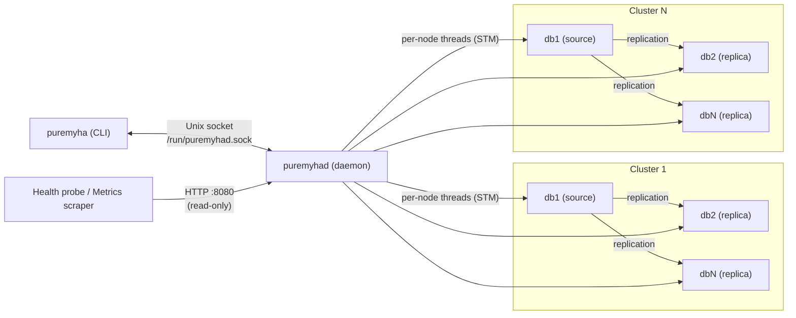

[](https://github.com/ikaro1192/PureMyHA/actions/workflows/ci.yml)
[](https://codecov.io/github/ikaro1192/PureMyHA)
[](https://github.com/ikaro1192/PureMyHA/releases/latest)
[](LICENSE)
[](https://www.haskell.org/)

# PureMyHA

<p align="center">
  
</p>

A simple yet powerful, pure-Haskell High Availability management tool for MySQL 8.4 replication topologies.

Inspired by the design of Orchestrator, PureMyHA provides topology discovery, failure detection, and automatic failover — with no C library dependencies.

## Philosophy

- **Pure Haskell, no C dependencies** — PureMyHA is built entirely on `mysql-haskell`, a pure-Haskell MySQL client. No libmysqlclient, no CGo, no FFI — just a single statically-linked binary that runs anywhere.
- **Correctness before convenience** — Every failover decision is GTID-aware: errant GTIDs are detected and repaired, relay log application is awaited before promotion, and split-brain scenarios are identified before acting. A failover that corrupts data is worse than no failover.
- **Simple by deliberate omission** — PureMyHA targets MySQL 8.4+ exclusively and does not support legacy syntax, older authentication plugins, or non-GTID topologies. Saying no to compatibility layers keeps the code small, auditable, and correct.
- **Do one thing well** — PureMyHA is a focused HA tool, not a topology manager, query router, or schema migration framework. It detects failure, promotes a replica, and gets out of the way.
- **Delegate what you do not own** — PureMyHA does not implement its own leader election. Its own high availability is delegated entirely to Pacemaker, which is already purpose-built for that problem.
- **Stateless by design** — The daemon holds no durable state. All topology knowledge is derived from MySQL on startup and continuously refreshed at runtime, making recovery from a daemon crash trivially safe.
- **Transparent operation** — Dry-run mode, config hot-reload, and pause/resume controls give operators full visibility and control without requiring a daemon restart.

## Features

### Topology & Discovery
- **Topology Discovery** — Recursively maps replication trees from seed hosts; new nodes are detected automatically at a configurable interval
- **MySQL 8.4 Native** — Uses only modern syntax (`SHOW REPLICA STATUS`, `CHANGE REPLICATION SOURCE TO`); no legacy compatibility layers

### Failover & Safety
- **Automatic Failover** — Detects dead sources and promotes the best replica (GTID-aware, errant-GTID-safe, waits for relay log apply)
- **Manual Switchover** — Planned maintenance with zero-data-loss semantics; supports `--dry-run` preview
- **Errant GTID Detection & Repair** — Identifies and fixes errant GTIDs via empty transactions
- **Failure Thresholds & Anti-Flap** — Requires N consecutive probe failures before marking a node dead; blocks repeated failovers via `recovery_block_period`
- **Auto-Fence Split-Brain** — Automatically sets `super_read_only=ON` on non-survivor sources when split-brain is suspected (opt-in)

### Replica Health
- **Replica Lag Monitoring** — Transitions lagging replicas to `Lagging` health and excludes them from failover candidates; separate stricter threshold for candidate selection
- **Replica Re-seeding** — Re-seed a replica from a donor using the MySQL CLONE plugin (`puremyha clone`)

### Observability & Integrations
- **HTTP Endpoints** — Optional read-only HTTP listener: `/health`, `/cluster/:name/status`, `/cluster/:name/topology` for load balancers and Kubernetes probes
- **Prometheus Metrics** — `GET /metrics` exposes cluster health, replication lag, consecutive failures, and node role
- **Hooks** — Pre/post hooks for failover and switchover; `on_lag_threshold_exceeded` / `on_lag_threshold_recovered` for alerting
- **Optional TLS** — Per-cluster TLS for MySQL connections with configurable verification mode and minimum TLS version (the daemon emits a startup/SIGHUP WARN when `skip-verify` is used, so development-only settings cannot silently ship to production)

### Operator Controls
- **Config Hot-Reload** — Reloads `monitoring` and `hooks` config on SIGHUP without restart
- **Pause/Resume Replica** — Exclude a replica from failover candidates without stopping MySQL replication
- **Stop/Start Replication** — Stop or start MySQL replication on a replica (auto-pauses/resumes failover candidacy)
- **Pause/Resume Auto-Failover** — Temporarily disable automatic failover for maintenance windows
- **Runtime Log Level** — Change verbosity without restarting via `puremyha set-log-level`
- **Config Validation** — `puremyha validate-config` validates offline, no daemon required

See [docs/features.md](docs/features.md) for the full feature reference including all configuration keys, thresholds, and recovery procedures.

## Requirements

- **MySQL**: 8.4+ with GTID enabled (`gtid_mode=ON`, `enforce_gtid_consistency=ON`) and `caching_sha2_password` authentication (default in MySQL 8.4). `mysql_native_password` is not supported.
- **OS**: Linux
- **HA for PureMyHA itself** *(optional)*: Pacemaker + QDevice (recommended) or VIP-watching cron / systemd.timer (simple)

See [docs/configuration.md](docs/configuration.md) for required MySQL user privileges and full configuration reference.

## Architecture



| Component    | Role |
|-------------|------|
| `puremyhad` | Long-running daemon. Topology monitoring, failure detection, automatic failover |
| `puremyha`  | CLI tool. Status display and manual operations |

Daemon and CLI communicate over a Unix domain socket (`/run/puremyhad.sock`) using newline-delimited JSON.
An optional HTTP listener (disabled by default) exposes read-only health check endpoints for external probes.

PureMyHA does **not** implement leader election itself. See [docs/daemon-ha.md](docs/daemon-ha.md) for Pacemaker and VIP-watching setup instructions.

## Installation

### From packages (recommended)

Download the latest release from the [Releases page](https://github.com/ikaro1192/PureMyHA/releases).

#### Debian / Ubuntu

```bash
sudo dpkg -i puremyha_<VERSION>_amd64.deb    # x86_64
sudo dpkg -i puremyha_<VERSION>_arm64.deb    # aarch64
```

#### RHEL / Rocky / AlmaLinux

```bash
sudo rpm -ivh puremyha-<VERSION>-1.x86_64.rpm   # x86_64
sudo rpm -ivh puremyha-<VERSION>-1.aarch64.rpm  # aarch64
```

#### Post-install setup

```bash
# Copy the example config and edit it
sudo cp /etc/puremyha/config.yaml.example /etc/puremyha/config.yaml
sudo vi /etc/puremyha/config.yaml

# Enable and start the daemon
sudo systemctl enable --now puremyhad
```

### From source

- **Build requirements:** GHC 9.x+ and Cabal 3.0+ (not needed for package installs)

```bash
git clone https://github.com/ikaro1192/PureMyHA
cd PureMyHA
cabal build all
cabal install puremyhad puremyha
```

### Docker build (Linux binary)

Build Linux binaries without installing GHC locally.

```bash
# Build (tests run automatically during build)
docker build -t puremyha .

# Extract binaries
mkdir -p dist-bins
docker create --name tmp puremyha
docker cp tmp:/usr/bin/puremyha ./dist-bins/
docker cp tmp:/usr/sbin/puremyhad ./dist-bins/
docker rm tmp
```

## Configuration

```yaml
clusters:
  - name: main
    nodes:
      - host: db1
        port: 3306
      - host: db2
        port: 3306
    credentials:
      user: puremyha
      password_file: /etc/puremyha/mysql.pass

global:
  monitoring:
    interval: 3s
    connect_timeout: 2s
  failure_detection:
    consecutive_failures_for_dead: 3
    recovery_block_period: 3600s
  failover:
    auto_failover: true
    min_replicas_for_failover: 1
```

See [docs/configuration.md](docs/configuration.md) for the full configuration reference including all fields, per-cluster overrides, and MySQL user setup.

## Usage

```bash
# Start the daemon
puremyhad --config /etc/puremyha/config.yaml

# Show topology and node health
puremyha status

# Show replication tree
puremyha topology

# Manual switchover (planned maintenance)
puremyha switchover [--to=<host>] [--drain-timeout=<secs>]

# Validate config file offline
puremyha validate-config
```

See [docs/cli.md](docs/cli.md) for the full CLI reference including all commands, global flags, and JSON output examples.

## Documentation

- [docs/features.md](docs/features.md) — Full feature reference with configuration keys and examples
- [docs/configuration.md](docs/configuration.md) — Full configuration reference and MySQL user setup
- [docs/cli.md](docs/cli.md) — CLI commands and global flags
- [docs/http-api.md](docs/http-api.md) — HTTP health check and Prometheus metrics endpoints
- [docs/logging.md](docs/logging.md) — Log levels, events, and log rotation
- [docs/failover.md](docs/failover.md) — Failover flow and failure scenarios
- [docs/daemon-ha.md](docs/daemon-ha.md) — Daemon HA setup (Pacemaker and VIP-watching)
- [docs/development.md](docs/development.md) — Build instructions and E2E test setup

## Technology Stack

| Purpose | Library |
|---------|---------|
| MySQL connectivity | `mysql-haskell` (pure Haskell, no C library dependency) + optional TLS (1.2 / 1.3) |
| Configuration | `yaml` + `optparse-applicative` |
| Concurrency | `async` + `STM` (each node monitored in an independent thread) |
| Logging | `katip` (structured logging with JSON output) |
| IPC | Unix domain socket, newline-delimited JSON |
| HTTP health checks | `warp` + `wai` (pure Haskell, optional read-only listener) |

## Development

See [docs/development.md](docs/development.md) for build instructions, unit tests, and E2E test setup.

## License

MIT
