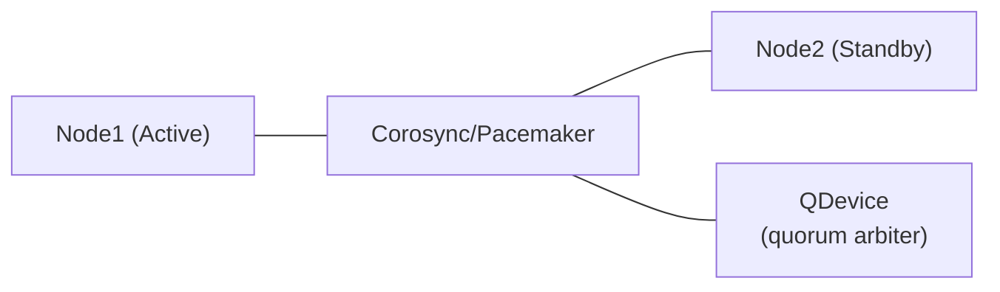

# Daemon HA Setup

PureMyHA does **not** implement leader election itself. Two approaches are available:

- [Pacemaker (recommended)](#pacemaker-recommended) — full cluster management with STONITH fencing
- [VIP-watching cron / systemd.timer (simple)](#vip-watching-cron--systemdtimer-simple) — lightweight alternative when a VIP is already managed by keepalived

---

## Pacemaker (recommended)



Delegates leader election entirely to Pacemaker + QDevice. Daemon state is held in memory only and rebuilt from MySQL on restart.

Sample configuration files and a Docker Compose demo are in [`pacemaker-sample/`](../pacemaker-sample/).

### Quick start (Docker Compose demo)

```bash
cd pacemaker-sample/demo

# 1. Build the puremyhad binary and cluster images
make build

# 2. Start containers (ha1, ha2, qdevice)
make start

# 3. Initialize the cluster
make setup

# 4. Check cluster status
make status

# 5. Test failover (puremyhad moves from ha1 to ha2)
make failover

# 6. Clean up
make clean
```

> **Note:** STONITH is disabled in the demo. See the production setup below.

### Production setup

**Target topology**

| Host | Role | Required packages |
|------|------|-------------------|
| ha1 (192.168.10.11) | Cluster node (Active) | pacemaker, pcs, corosync, fence-agents |
| ha2 (192.168.10.12) | Cluster node (Standby) | pacemaker, pcs, corosync, fence-agents |
| qdevice (192.168.10.13) | Quorum arbiter only | corosync-qnetd |

A Virtual IP (e.g. `192.168.10.100`) floats to whichever node runs `puremyhad`.

**Step 1 — Install packages**

```bash
# On ha1 and ha2:
apt-get install -y pacemaker pcs corosync fence-agents   # Debian/Ubuntu
# dnf install -y pacemaker pcs corosync fence-agents-all  # RHEL/Rocky

# On the QDevice host only:
apt-get install -y corosync-qnetd
systemctl enable --now corosync-qnetd
```

**Step 2 — Configure Corosync**

Copy [`pacemaker-sample/corosync.conf.example`](../pacemaker-sample/corosync.conf.example) to `/etc/corosync/corosync.conf` on **both** ha1 and ha2. Replace the example IPs with your actual addresses.

**Step 3 — Disable systemd auto-restart for puremyhad**

`puremyhad.service` has `Restart=on-failure`. When Pacemaker manages the daemon, systemd must **not** restart it independently — they would race.

Run on **both** ha1 and ha2:

```bash
mkdir -p /etc/systemd/system/puremyhad.service.d/
cat > /etc/systemd/system/puremyhad.service.d/pacemaker.conf << 'EOF'
[Service]
Restart=no
EOF
systemctl daemon-reload
systemctl disable puremyhad   # Pacemaker starts it, not systemd
```

**Step 4 — Install the OCF Resource Agent**

```bash
# On ha1 and ha2:
install -m 755 pacemaker-sample/ocf/puremyha \
    /usr/lib/ocf/resource.d/puremyha/puremyhad
```

**Step 5 — Bootstrap the cluster**

```bash
# Set the hacluster password (same on both nodes):
echo "PASSWORD" | passwd --stdin hacluster

# Run on ha1 only:
pcs host auth ha1 ha2 -u hacluster -p PASSWORD
pcs cluster setup puremyha-cluster ha1 ha2 --start --enable
```

**Step 6 — Add the QDevice**

```bash
pcs quorum device add model net host=192.168.10.13 algorithm=ffsplit
pcs quorum status   # confirm expected_votes: 3
```

**Step 7 — Configure STONITH**

STONITH is **mandatory** in production. Without fencing, a split-brain can leave two nodes running `puremyhad` simultaneously.

```bash
# IPMI/BMC fencing (bare metal):
pcs stonith create fence-ha1 fence_ipmilan \
    ipaddr=192.168.10.101 login=admin passwd=PASSWORD lanplus=1 \
    pcmk_host_list=ha1
pcs stonith create fence-ha2 fence_ipmilan \
    ipaddr=192.168.10.102 login=admin passwd=PASSWORD lanplus=1 \
    pcmk_host_list=ha2

# Each node is fenced by the other:
pcs constraint location fence-ha1 avoids ha1
pcs constraint location fence-ha2 avoids ha2
```

**Step 8 — Create resources**

```bash
# Virtual IP
pcs resource create puremyha-vip IPaddr2 \
    ip=192.168.10.100 cidr_netmask=24 \
    op monitor interval=10s

# puremyhad daemon (OCF RA)
pcs resource create puremyhad ocf:puremyha:puremyhad \
    config=/etc/puremyha/config.yaml \
    socket=/run/puremyhad.sock \
    op start timeout=30s op stop timeout=60s \
    op monitor interval=15s timeout=15s

# VIP always colocated with puremyhad; puremyhad starts first
pcs constraint colocation add puremyha-vip with puremyhad INFINITY
pcs constraint order puremyhad then puremyha-vip
```

See [`pacemaker-sample/setup.sh`](../pacemaker-sample/setup.sh) for a fully annotated reference script.

### Verification

```bash
# Overall cluster health
pcs status

# Confirm QDevice vote is active (expected_votes: 3)
pcs quorum status

# Planned failover test
pcs node standby ha1          # puremyhad migrates to ha2
pcs status
pcs node unstandby ha1        # ha1 rejoins as standby

# Confirm socket exists only on the active node
ls -la /run/puremyhad.sock    # run on the active node — should exist

# Config reload (sends SIGHUP via ExecReload in the systemd unit)
pcs resource reload puremyhad
```

---

## VIP-watching cron / systemd.timer (simple)

A simpler alternative that requires only a shared VIP (e.g. managed by keepalived).
Each node periodically checks whether the VIP is assigned to a local interface, and starts or stops `puremyhad` accordingly.

**cron:**

```cron
* * * * * ip addr show | grep -q <VIP> && systemctl start puremyhad || systemctl stop puremyhad
```

**systemd.timer** (modern alternative to cron):

```ini
# /etc/systemd/system/puremyhad-vip-watch.timer
[Unit]
Description=PureMyHA VIP watch timer

[Timer]
OnBootSec=30s
OnUnitActiveSec=1min

[Install]
WantedBy=timers.target
```

```ini
# /etc/systemd/system/puremyhad-vip-watch.service
[Unit]
Description=PureMyHA VIP watch

[Service]
Type=oneshot
ExecStart=/bin/sh -c 'ip addr show | grep -q <VIP> && systemctl start puremyhad || systemctl stop puremyhad'
```

This avoids the complexity of Corosync/Pacemaker/QDevice — suitable when a VIP is already managed by another mechanism such as keepalived. Daemon state is held in memory only and rebuilt from MySQL on restart.
