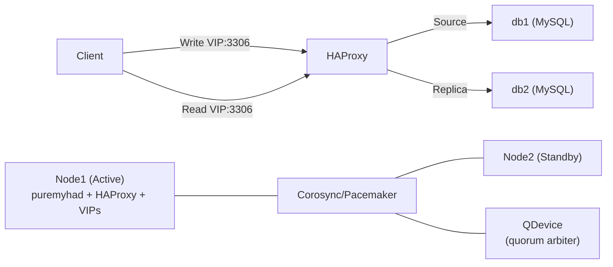

# Daemon HA Setup

PureMyHA does **not** implement leader election itself. Two approaches are available:

- [Pacemaker (recommended)](#pacemaker-recommended) — full cluster management with STONITH fencing
- [VIP-watching cron / systemd.timer (simple)](#vip-watching-cron--systemdtimer-simple) — lightweight alternative when a VIP is already managed by keepalived

---

## Pacemaker (recommended)



Delegates leader election entirely to Pacemaker + QDevice. Daemon state is held in memory only and rebuilt from MySQL on restart.

HAProxy runs on the same node as `puremyhad` and routes MySQL traffic in TCP (Layer 4) mode. Two VIPs provide separate endpoints for writes and reads — both on port 3306. PureMyHA hook scripts update HAProxy backends automatically on failover or switchover.

Sample configuration files and a Docker Compose demo are in [`pacemaker-sample/`](../pacemaker-sample/).

### Quick start (Docker Compose demo)

The demo includes two MySQL 8.4 containers (db1 as source, db2 as replica) with GTID-based replication, in addition to the Pacemaker cluster nodes and QDevice.

```bash
cd pacemaker-sample/demo

# 1. Build the puremyhad binary and cluster images
make build

# 2. Start containers (db1, db2, ha1, ha2, qdevice)
make start

# 3. Initialize MySQL replication and the Pacemaker cluster
make setup

# 4. Check cluster status
make status

# 5. Test failover (puremyhad moves from ha1 to ha2)
make failover

# 6. Clean up
make clean
```

> **Note:** STONITH is disabled in the demo. See the production setup below.

### Production setup

**Target topology**

| Host | Role | Required packages |
|------|------|-------------------|
| ha1 (192.168.10.11) | Cluster node (Active) | pacemaker, pcs, corosync, fence-agents, haproxy, socat |
| ha2 (192.168.10.12) | Cluster node (Standby) | pacemaker, pcs, corosync, fence-agents, haproxy, socat |
| qdevice (192.168.10.13) | Quorum arbiter only | corosync-qnetd |

Two Virtual IPs float to whichever node runs `puremyhad`:

| VIP | Purpose |
|-----|---------|
| 192.168.10.100 (Write VIP) | Routes to the MySQL source via HAProxy |
| 192.168.10.101 (Read VIP) | Routes to MySQL replicas via HAProxy |

**Step 1 — Install packages**

```bash
# On ha1 and ha2:
apt-get install -y pacemaker pcs corosync fence-agents haproxy socat   # Debian/Ubuntu
# dnf install -y pacemaker pcs corosync fence-agents-all haproxy socat  # RHEL/Rocky

# On the QDevice host only:
apt-get install -y corosync-qnetd
systemctl enable --now corosync-qnetd
```

**Step 2 — Configure Corosync**

Copy [`pacemaker-sample/corosync.conf.example`](../pacemaker-sample/corosync.conf.example) to `/etc/corosync/corosync.conf` on **both** ha1 and ha2. Replace the example IPs with your actual addresses.

**Step 3 — Disable systemd auto-restart for puremyhad**

`puremyhad.service` has `Restart=on-failure`. When Pacemaker manages the daemon, systemd must **not** restart it independently — they would race.

Run on **both** ha1 and ha2:

```bash
mkdir -p /etc/systemd/system/puremyhad.service.d/
cat > /etc/systemd/system/puremyhad.service.d/pacemaker.conf << 'EOF'
[Service]
Restart=no
EOF
systemctl daemon-reload
systemctl disable puremyhad   # Pacemaker starts it, not systemd
```

**Step 4 — Install the OCF Resource Agent**

```bash
# On ha1 and ha2:
install -m 755 pacemaker-sample/ocf/puremyha \
    /usr/lib/ocf/resource.d/puremyha/puremyhad
```

**Step 5 — Deploy HAProxy configuration and hook scripts**

Run on **both** ha1 and ha2:

```bash
# Deploy HAProxy config (edit VIP addresses and server entries first):
cp pacemaker-sample/haproxy/haproxy.cfg.example /etc/haproxy/haproxy.cfg
mkdir -p /run/haproxy

# Install hook scripts:
mkdir -p /etc/puremyha/hooks
install -m 755 pacemaker-sample/haproxy/hooks/haproxy-common.sh \
    /etc/puremyha/hooks/haproxy-common.sh
install -m 755 pacemaker-sample/haproxy/hooks/post_failover.sh \
    /etc/puremyha/hooks/post_failover.sh
install -m 755 pacemaker-sample/haproxy/hooks/post_switchover.sh \
    /etc/puremyha/hooks/post_switchover.sh

# Disable HAProxy systemd service — Pacemaker manages it:
systemctl disable haproxy
systemctl stop haproxy
```

Add the hooks to your PureMyHA config (`/etc/puremyha/config.yaml`):

```yaml
global:
  hooks:
    post_failover: /etc/puremyha/hooks/post_failover.sh
    post_switchover: /etc/puremyha/hooks/post_switchover.sh
```

**Step 6 — Bootstrap the cluster**

```bash
# Set the hacluster password (same on both nodes):
echo "PASSWORD" | passwd --stdin hacluster

# Run on ha1 only:
pcs host auth ha1 ha2 -u hacluster -p PASSWORD
pcs cluster setup puremyha-cluster ha1 ha2 --start --enable
```

**Step 7 — Add the QDevice**

```bash
pcs quorum device add model net host=192.168.10.13 algorithm=ffsplit
pcs quorum status   # confirm expected_votes: 3
```

**Step 8 — Configure STONITH**

STONITH is **mandatory** in production. Without fencing, a split-brain can leave two nodes running `puremyhad` simultaneously.

```bash
# IPMI/BMC fencing (bare metal):
pcs stonith create fence-ha1 fence_ipmilan \
    ipaddr=192.168.10.101 login=admin passwd=PASSWORD lanplus=1 \
    pcmk_host_list=ha1
pcs stonith create fence-ha2 fence_ipmilan \
    ipaddr=192.168.10.102 login=admin passwd=PASSWORD lanplus=1 \
    pcmk_host_list=ha2

# Each node is fenced by the other:
pcs constraint location fence-ha1 avoids ha1
pcs constraint location fence-ha2 avoids ha2
```

**Step 9 — Create resources and resource group**

```bash
# puremyhad daemon (OCF RA)
pcs resource create puremyhad ocf:puremyha:puremyhad \
    config=/etc/puremyha/config.yaml \
    socket=/run/puremyhad.sock \
    op start timeout=30s op stop timeout=60s \
    op monitor interval=15s timeout=15s

# HAProxy (use systemd:haproxy in production with systemd)
pcs resource create haproxy systemd:haproxy \
    op start timeout=30s op stop timeout=30s \
    op monitor interval=10s timeout=10s

# Write VIP — clients connect here for read-write access
pcs resource create vip-write IPaddr2 \
    ip=192.168.10.100 cidr_netmask=24 \
    op monitor interval=10s

# Read VIP — clients connect here for read-only access
pcs resource create vip-read IPaddr2 \
    ip=192.168.10.101 cidr_netmask=24 \
    op monitor interval=10s

# Resource group: ensures colocation and correct start/stop order
# VIPs must be assigned before HAProxy starts — HAProxy binds to VIP addresses.
#   Start: puremyhad → vip-write → vip-read → haproxy
#   Stop:  haproxy → vip-read → vip-write → puremyhad
pcs resource group add puremyha-group \
    puremyhad vip-write vip-read haproxy
```

See [`pacemaker-sample/setup.sh`](../pacemaker-sample/setup.sh) for a fully annotated reference script.

### Verification

```bash
# Overall cluster health — all 4 resources in puremyha-group should be Started
pcs status

# Confirm QDevice vote is active (expected_votes: 3)
pcs quorum status

# Planned failover test
pcs node standby ha1          # entire resource group migrates to ha2
pcs status
pcs node unstandby ha1        # ha1 rejoins as standby

# Confirm socket exists only on the active node
ls -la /run/puremyhad.sock    # run on the active node — should exist

# Check HAProxy is listening and stats socket exists on the active node
ss -tlnp | grep 3306
echo "show stat" | socat stdio /run/haproxy/admin.sock

# Config reload (sends SIGHUP via ExecReload in the systemd unit)
pcs resource reload puremyhad
```

### MySQL operations (Docker Compose demo)

The demo Makefile provides targets for MySQL-level operations via the `puremyha` CLI. These commands are automatically routed to the Pacemaker node currently running `puremyhad`.

#### Switchover (graceful role swap)

```bash
# Auto-select the best replica as new source
make switchover

# Switch to a specific host
make switchover TO=db2
```

`puremyha switchover` performs a graceful source ↔ replica role swap: the current source is demoted, the target replica is promoted, and HAProxy backends are updated via the `post_switchover` hook. Client connections are briefly interrupted during the transition.

#### Simulating MySQL source failure

```bash
# Stop the MySQL source container (simulates source crash)
make stop-source            # stops db1 by default
make stop-source HOST=db2   # or specify a different host

# Watch puremyhad detect the failure and trigger auto-failover (~20-30s)
make topology      # or: make logs

# After failover, acknowledge the recovery block to re-enable auto-failover
make ack-recovery

# Restart the old source container
make start-source           # starts db1 by default
```

`stop-source` stops the MySQL container via `docker compose stop`. MySQL receives SIGTERM and closes all client connections immediately. The container's network interface is then removed, so subsequent TCP connections fail at the ARP level. Auto-failover triggers within approximately 20–30 seconds.

After auto-failover, an anti-flap recovery block prevents further automatic failovers for `recovery_block_period` (default 3600s). Run `make ack-recovery` to clear the block when you are ready.

#### Other MySQL operations

```bash
# Show the current MySQL topology as seen by puremyhad
make topology

# Show HAProxy backend routing (which server handles source/replica traffic)
make haproxy-stat

# Pause auto-failover (e.g. during planned maintenance)
make pause-failover

# Resume auto-failover
make resume-failover
```

#### Demo targets summary

| Target | Description |
|--------|-------------|
| `make switchover [TO=host]` | Graceful source ↔ replica role swap |
| `make stop-source [HOST=host]` | Simulate source failure (stops MySQL container, default: db1) |
| `make start-source [HOST=host]` | Restart a stopped MySQL container (default: db1) |
| `make topology` | Show MySQL topology from puremyhad |
| `make haproxy-stat` | Show HAProxy backend server status and routing |
| `make ack-recovery` | Clear anti-flap recovery block |
| `make pause-failover` | Pause automatic failover |
| `make resume-failover` | Resume automatic failover |

---

## VIP-watching cron / systemd.timer (simple)

A simpler alternative that requires only a shared VIP (e.g. managed by keepalived).
Each node periodically checks whether the VIP is assigned to a local interface, and starts or stops `puremyhad` accordingly.

**cron:**

```cron
* * * * * ip addr show | grep -q <VIP> && systemctl start puremyhad || systemctl stop puremyhad
```

**systemd.timer** (modern alternative to cron):

```ini
# /etc/systemd/system/puremyhad-vip-watch.timer
[Unit]
Description=PureMyHA VIP watch timer

[Timer]
OnBootSec=30s
OnUnitActiveSec=1min

[Install]
WantedBy=timers.target
```

```ini
# /etc/systemd/system/puremyhad-vip-watch.service
[Unit]
Description=PureMyHA VIP watch

[Service]
Type=oneshot
ExecStart=/bin/sh -c 'ip addr show | grep -q <VIP> && systemctl start puremyhad || systemctl stop puremyhad'
```

This avoids the complexity of Corosync/Pacemaker/QDevice — suitable when a VIP is already managed by another mechanism such as keepalived. Daemon state is held in memory only and rebuilt from MySQL on restart.
